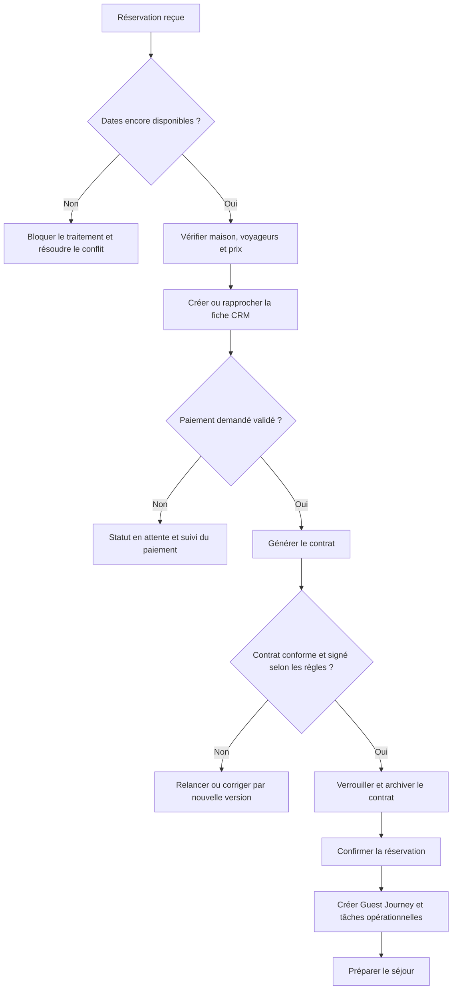

# Manuel Opérationnel Beaux Rivages

**Version :** 1.0  
**Propriétaires métier :** Stéphanie & Bruno  
**Statut :** manuel officiel d’exploitation quotidienne  
**Périmètre :** hébergements exploités sous la marque Beaux Rivages

## Objet du manuel

Ce manuel décrit la conduite quotidienne de l’activité Beaux Rivages, depuis la
mise à disposition des dates jusqu’au suivi après séjour. Il permet à Stéphanie,
Bruno et aux collaborateurs autorisés d’appliquer une méthode commune, de
conserver une trace des décisions et d’offrir une expérience cohérente.

Le manuel s’appuie sur :

- les règles métier de réservation, paiement et contrat ;
- le Guest Journey ;
- le Carnet Beaux Rivages ;
- les processus Housekeeping et Maintenance ;
- le Playbook d’hospitalité ;
- les Runbooks techniques et de gestion des incidents.

Il ne contient ni code d’accès, ni mot de passe, ni secret, ni coordonnées
privées. Ces informations restent dans l’espace documentaire confidentiel prévu
à cet effet.

## Principes d’exploitation

1. Nous accueillons un voyageur, pas un dossier.
2. La sécurité des personnes et des données prime sur la continuité commerciale.
3. La réservation, le paiement et le contrat sont vérifiés avant toute promesse.
4. Une information incertaine est contrôlée avant d’être transmise.
5. Une action importante est attribuée, horodatée et historisée.
6. Une anomalie n’est jamais masquée par une correction manuelle non tracée.
7. Les messages restent chaleureux, simples et conformes au Brand Book.
8. Une prestation n’est annoncée que si elle est réellement disponible.
9. Les recommandations signées Stéphanie & Bruno sont connues et actualisées.
10. Chaque séjour doit améliorer le suivant.

---

## 1. Avant la réservation

### 1.1 Objectif

Présenter des disponibilités et des prix fiables afin qu’un voyageur puisse
réserver sereinement, sans risque de chevauchement ni promesse impossible à
tenir.

### 1.2 Contrôle des disponibilités

Chaque jour d’activité :

1. ouvrir le calendrier consolidé ;
2. vérifier les trois maisons ;
3. comparer les réservations directes et les canaux effectivement connectés ;
4. repérer les blocages propriétaires, maintenances et indisponibilités ;
5. vérifier les arrivées et départs rapprochés ;
6. traiter toute alerte de synchronisation avant d’ouvrir la date à la vente.

Une date n’est jamais rendue disponible uniquement parce qu’aucune réservation
n’apparaît dans une vue. Il faut également vérifier les blocages, incidents et
synchronisations en attente.

### 1.3 Synchronisation des plateformes

Pour Airbnb, Booking, Abritel ou tout canal activé :

- contrôler la dernière synchronisation ;
- examiner les erreurs, retards et conflits ;
- rapprocher les réservations récentes avec le calendrier Beaux Rivages ;
- vérifier les annulations et modifications de dates ;
- ne pas relancer plusieurs fois une synchronisation sans vérifier son
  idempotence ;
- documenter tout écart dans le journal des synchronisations.

En cas de doute sur une disponibilité, bloquer temporairement la date et
contrôler les sources avant de répondre au voyageur.

### 1.4 Contrôle des prix

Vérifier :

- le tarif de base de chaque maison ;
- la saison et la période applicables ;
- les durées minimale et maximale ;
- les éventuels tarifs de week-end ;
- les frais de ménage et taxes ;
- les expériences ou packs sélectionnables ;
- le prix minimum et le prix maximum ;
- la cohérence du total présenté.

Toute recommandation tarifaire reste soumise à validation humaine. Une
modification de prix doit être datée et historisée.

### 1.5 Promotions

Avant d’activer ou de maintenir une promotion :

- confirmer sa période de validité ;
- vérifier les maisons et séjours compatibles ;
- contrôler les conditions de cumul ;
- vérifier le prix final après réduction ;
- confirmer le code ou le segment concerné ;
- retirer la promotion à son expiration ;
- vérifier que le texte publié ne crée pas une promesse ambiguë.

### 1.6 Checklist quotidienne avant réservation

- [ ] Calendrier des trois maisons contrôlé.
- [ ] Réservations directes et OTA rapprochées.
- [ ] Aucune erreur de synchronisation non traitée.
- [ ] Aucun conflit ou chevauchement ouvert.
- [ ] Blocages propriétaires et maintenances à jour.
- [ ] Tarifs et règles de séjour cohérents.
- [ ] Promotions valides et correctement appliquées.
- [ ] Arrivées et départs des sept prochains jours contrôlés.
- [ ] Alertes du Dashboard examinées.
- [ ] Toute anomalie possède un responsable et une action.

---

## 2. Nouvelle réservation

### 2.1 Objectif

Transformer une demande en séjour confirmé, payé selon les conditions
applicables, contractualisé et prêt à être pris en charge par les opérations.

### 2.2 Diagramme du processus

### 2.3 Réception

À la réception d’une réservation :

- relever la source : directe, Airbnb, Booking, Abritel ou autre canal autorisé ;
- vérifier la référence externe et la référence Beaux Rivages ;
- identifier la maison, les dates et le statut ;
- contrôler si la création est nouvelle ou déjà connue ;
- vérifier que l’événement n’a pas été reçu deux fois.

### 2.4 Vérification

Contrôler :

- arrivée et départ ;
- nombre de nuits ;
- adultes, enfants, bébés et animaux ;
- capacité de la maison ;
- disponibilité réelle sur toute la période ;
- horaires ou demandes particulières ;
- options, packs et expériences ;
- tarif, frais, taxes et réduction ;
- coordonnées nécessaires du voyageur ;
- cohérence avec la plateforme d’origine.

Une incohérence bloque la confirmation jusqu’à résolution.

### 2.5 Paiement

Le statut du paiement doit correspondre à un événement réellement validé par le
prestataire.

- ne jamais marquer manuellement un paiement comme reçu sans preuve ;
- vérifier le montant, la devise, la réservation et la clé d’idempotence ;
- conserver l’historique des tentatives et transactions ;
- rapprocher l’état interne et l’état Stripe ;
- traiter un échec sans recréer immédiatement un second débit ;
- suivre les remboursements jusqu’à leur état final.

### 2.6 Acompte, solde ou paiement intégral

- **Acompte :** vérifier le montant reçu et la date attendue du solde.
- **Solde :** vérifier qu’il se rattache à la bonne réservation et qu’aucun
  montant identique n’est déjà en cours de traitement.
- **Paiement intégral :** vérifier que le total correspond au calcul de prix
  conservé pour la réservation.

Les conditions commerciales validées déterminent quand le contrat peut être
signé et quand la réservation devient confirmée.

### 2.7 Contrat

- générer le contrat depuis les données validées ;
- vérifier l’identité, la maison, les dates, le prix et les conditions ;
- utiliser la numérotation officielle ;
- envoyer la bonne version ;
- suivre la signature ;
- verrouiller le contrat après signature ;
- archiver l’original et son historique.

Une modification après signature crée une nouvelle version. L’original signé
n’est jamais modifié ni supprimé.

### 2.8 Confirmation

La confirmation précise, sans surcharge :

- la maison ;
- les dates ;
- le nombre de voyageurs ;
- le statut du paiement ;
- le statut du contrat ;
- la prochaine étape ;
- le moyen de joindre Beaux Rivages.

Les informations sensibles d’accès ne sont jamais envoyées prématurément.

### 2.9 CRM

À la création ou au rapprochement de la fiche voyageur :

- rechercher un profil existant avant de créer un doublon ;
- conserver les coordonnées nécessaires ;
- enregistrer la composition du séjour ;
- consigner les préférences uniquement si elles sont utiles et légitimes ;
- enregistrer animaux, allergies ou besoins particuliers avec discrétion ;
- appliquer les droits d’accès et durées de conservation ;
- historiser la source et les interactions importantes.

### 2.10 Préparation automatique du séjour

Après confirmation, vérifier la création de :

- l’échéancier Guest Journey ;
- la mission de ménage ou de préparation ;
- la checklist adaptée à la maison ;
- les alertes paiement et contrat ;
- les expériences et attentions demandées ;
- les tâches d’arrivée ;
- les événements du Dashboard.

### 2.11 Checklist nouvelle réservation

- [ ] Source et références vérifiées.
- [ ] Dates et disponibilité contrôlées.
- [ ] Voyageurs et capacité vérifiés.
- [ ] Prix et réduction rapprochés.
- [ ] Paiement ou acompte validé par preuve.
- [ ] Échéance du solde programmée si nécessaire.
- [ ] Contrat généré dans la bonne version.
- [ ] Signature suivie.
- [ ] Réservation confirmée au bon statut.
- [ ] Fiche CRM créée ou rapprochée.
- [ ] Guest Journey créé.
- [ ] Tâches de préparation créées.
- [ ] Demandes particulières attribuées.

---

## 3. Avant l’arrivée

### 3.1 Revue du séjour

Entre la confirmation et l’arrivée :

- relire la fiche de séjour ;
- vérifier les voyageurs, enfants, bébés et animaux ;
- contrôler les horaires annoncés ;
- examiner les préférences et occasions ;
- confirmer les expériences et attentions réellement disponibles ;
- vérifier paiement, contrat et demandes en attente ;
- adapter la préparation et les messages.

### 3.2 Checklist maison

- [ ] Ménage terminé selon la checklist de la maison.
- [ ] Toutes les étapes obligatoires sont validées.
- [ ] Photos de contrôle ajoutées lorsqu’elles sont requises.
- [ ] Contrôle qualité réalisé par la personne autorisée.
- [ ] Literie et linge préparés selon la réservation.
- [ ] Serviettes de plage et peignoirs préparés si prévus.
- [ ] Cuisine, vaisselle et réfrigérateur contrôlés.
- [ ] Eau fraîche déposée.
- [ ] Cadeau ou mot de bienvenue préparé si validé.
- [ ] Panier d’accueil préparé si commandé et confirmé.
- [ ] Pack Signature préparé si présent.
- [ ] Pack Romance ou attention particulière préparé si présent.
- [ ] Équipement bébé préparé si demandé.
- [ ] Accueil animal préparé si applicable.
- [ ] Wi-Fi testé.
- [ ] Éclairage et équipements essentiels testés.
- [ ] Télécommandes et piles contrôlées.
- [ ] Chauffage, ventilation ou climatisation vérifiés selon la saison.
- [ ] Eau chaude et sanitaires contrôlés.
- [ ] Extérieurs et barbecue contrôlés si disponibles.
- [ ] Détecteurs et équipements de sécurité contrôlés selon le planning.
- [ ] Aucun incident de maintenance bloquant n’est ouvert.

### 3.3 Checklist voyageur

- [ ] Message pré-arrivée programmé ou envoyé.
- [ ] Informations de trajet et stationnement vérifiées.
- [ ] Carnet numérique accessible.
- [ ] Conseils météo et saisonniers pertinents.
- [ ] Horaires d’arrivée confirmés.
- [ ] Besoins particuliers relus.
- [ ] Moyen d’assistance communiqué.
- [ ] Informations sensibles programmées dans la fenêtre autorisée.

### 3.4 Arrivée autonome

- vérifier que ce mode a été choisi ou confirmé ;
- tester le dispositif d’accès sans consigner le code dans ce document ;
- vérifier que le voyageur a reçu les repères autorisés ;
- programmer le code ou les instructions au bon moment ;
- prévoir une solution d’assistance ;
- contrôler l’ouverture après l’arrivée sans surveillance intrusive.

### 3.5 Arrivée personnalisée

- confirmer le créneau ;
- attribuer l’accueil à Stéphanie ou Bruno ;
- préparer la fiche d’accueil ;
- vérifier que la maison est prête avant le déplacement ;
- présenter les informations utiles sans prolonger inutilement l’arrivée ;
- respecter l’intimité du voyageur ;
- consigner la fin de l’accueil et toute demande exprimée.

### 3.6 Décision « maison prête »

La maison est déclarée prête uniquement si :

- la checklist est complète ;
- le contrôle qualité est validé ;
- aucun incident critique ou bloquant n’est ouvert ;
- les attentions promises sont présentes ;
- l’accès, le Wi-Fi et les équipements essentiels fonctionnent.

---

## 4. Pendant le séjour

### 4.1 Présence discrète

Beaux Rivages reste disponible sans multiplier les sollicitations. Le voyageur
doit savoir comment demander de l’aide et recevoir une réponse claire.

### 4.2 Assistance voyageurs

Pour chaque demande :

1. accuser réception rapidement ;
2. reformuler le besoin ;
3. évaluer l’urgence et l’impact ;
4. annoncer un délai réaliste ;
5. attribuer la résolution ;
6. tenir le voyageur informé ;
7. vérifier que la solution fonctionne ;
8. consigner l’apprentissage utile.

### 4.3 Communication

- utiliser le canal prévu pour le séjour ;
- conserver un ton chaleureux et naturel ;
- ne pas envoyer de donnée sensible dans un canal inadapté ;
- éviter les réponses automatiques lorsqu’une situation mérite un message
  personnel ;
- historiser les décisions importantes ;
- ne jamais promettre un remboursement ou une prestation sans autorisation.

### 4.4 Incidents dans la maison

Pour un incident :

- sécuriser les personnes ;
- protéger la maison ;
- qualifier la gravité ;
- créer ou mettre à jour le ticket de maintenance ;
- attribuer une personne ou un prestataire ;
- informer le voyageur du délai ;
- suivre l’intervention ;
- contrôler la résolution ;
- enregistrer les coûts, photos et commentaires nécessaires.

Un incident critique peut imposer le blocage immédiat de la maison.

### 4.5 Maintenance pendant séjour

Une intervention dans la maison occupée nécessite :

- l’accord ou l’information préalable du voyageur, sauf urgence de sécurité ;
- un créneau précis ;
- une personne identifiée ;
- le respect des lieux et de la confidentialité ;
- une validation après intervention ;
- une communication de clôture.

### 4.6 Recommandations et Carnet Beaux Rivages

Utiliser le Carnet pour proposer :

- restaurants et producteurs ;
- marchés et villages ;
- plages et balades ;
- pistes cyclables ;
- activités selon la météo ;
- conseils de saison ;
- recommandations de Stéphanie & Bruno.

Avant une recommandation personnelle, vérifier :

- l’ouverture ;
- la saison ;
- la pertinence pour le groupe ;
- la date de dernière validation ;
- l’absence de changement connu.

### 4.7 Point de milieu de séjour

Lorsqu’il est prévu :

- envoyer un message bref et non intrusif ;
- vérifier que tout se passe bien ;
- proposer une aide concrète ;
- traiter immédiatement une difficulté signalée ;
- éviter toute sollicitation commerciale agressive.

---

## 5. Départ

### 5.1 Message avant départ

Le message automatique ou personnalisé :

- remercie le voyageur ;
- rappelle l’heure convenue ;
- donne des consignes courtes et réalistes ;
- précise le traitement des clés ou de l’accès ;
- rappelle comment signaler un problème ;
- évite une liste culpabilisante.

### 5.2 Procédure de départ

1. confirmer le départ effectif ;
2. clôturer ou désactiver l’accès selon la procédure sécurisée ;
3. lancer la mission de contrôle et de ménage ;
4. effectuer l’état des lieux opérationnel ;
5. relever les objets oubliés ;
6. contrôler les équipements et consommables ;
7. vérifier le linge ;
8. documenter les dommages éventuels ;
9. créer un ticket de maintenance si nécessaire ;
10. remettre à jour la disponibilité uniquement lorsque la maison est sûre.

### 5.3 État des lieux et contrôle

Le contrôle porte notamment sur :

- état général et propreté ;
- chambres, salles d’eau et sanitaires ;
- cuisine et appareils ;
- mobilier et décoration ;
- Wi-Fi et équipements ;
- extérieurs et barbecue ;
- inventaire et objets manquants ;
- dégâts visibles ou signalés.

Les photos sont prises uniquement lorsqu’elles sont nécessaires, datées et
stockées dans l’espace autorisé.

### 5.4 Ménage

- créer ou confirmer la mission ;
- attribuer la checklist correspondant à la maison et au séjour ;
- intégrer linge, animaux, packs ou besoins particuliers ;
- compléter toutes les étapes ;
- ajouter les preuves requises ;
- effectuer le contrôle qualité ;
- clôturer uniquement lorsque la checklist est complète.

### 5.5 Linge

- compter le linge remis et récupéré selon la procédure interne ;
- isoler les articles tachés ou endommagés ;
- enregistrer les besoins de remplacement ;
- préparer les quantités du prochain séjour ;
- suivre le stock sans exposer de données voyageur.

### 5.6 Dépôt de garantie

- vérifier les conditions contractuelles applicables ;
- ne pas retenir un montant sans preuve et validation ;
- documenter les faits, photos, devis ou factures nécessaires ;
- informer le voyageur avec un message factuel ;
- conserver l’historique de la décision ;
- suivre la libération ou la retenue jusqu’à son terme.

### 5.7 Facture et paiement final

- vérifier les paiements, remboursements et solde ;
- rapprocher les expériences ajoutées au séjour ;
- générer ou transmettre la facture selon les règles applicables ;
- conserver le document dans l’historique ;
- traiter tout écart avant clôture financière.

### 5.8 Remerciement et avis

Ordre recommandé :

1. remercier sincèrement ;
2. évoquer un élément réel du séjour lorsque cela est approprié ;
3. confirmer que Beaux Rivages reste disponible ;
4. demander un avis sans pression ;
5. suivre la réponse ;
6. ne pas multiplier les relances.

### 5.9 Checklist départ

- [ ] Message de départ envoyé.
- [ ] Départ confirmé.
- [ ] Accès traité selon la procédure.
- [ ] État des lieux réalisé.
- [ ] Objets oubliés enregistrés.
- [ ] Mission de ménage complète.
- [ ] Linge contrôlé.
- [ ] Incident ou dommage documenté.
- [ ] Dépôt de garantie traité.
- [ ] Solde et facture rapprochés.
- [ ] Disponibilité remise à jour.
- [ ] Remerciement envoyé.
- [ ] Demande d’avis programmée.

---

## 6. Après le séjour

### 6.1 Archivage

Vérifier la présence et l’état final de :

- réservation ;
- transactions et remboursements ;
- contrat et versions ;
- facture ;
- messages importants ;
- tâches d’arrivée et de départ ;
- mission Housekeeping ;
- incidents Maintenance ;
- avis et retour voyageur.

Aucune donnée métier critique n’est supprimée. Les durées de conservation et
les suppressions logiques suivent les règles approuvées.

### 6.2 Mise à jour CRM

- ajouter le séjour à l’historique ;
- actualiser le nombre de séjours et de nuits ;
- enregistrer les préférences utiles confirmées ;
- consigner animaux, composition familiale ou occasions sans excès ;
- noter les incidents de manière factuelle ;
- enregistrer l’avis et les interactions ;
- corriger ou fusionner un doublon selon la procédure contrôlée.

### 6.3 Statistiques

Après rapprochement :

- revenu du séjour ;
- ADR ;
- taux d’occupation ;
- canal d’origine ;
- panier moyen ;
- expériences ou packs ;
- coût de ménage et interventions ;
- satisfaction ;
- incident éventuel.

Une statistique n’est publiée que si sa définition et sa source sont connues.

### 6.4 Fidélisation

La fidélisation repose sur la reconnaissance, pas sur la pression :

- remercier avant toute proposition ;
- utiliser uniquement les préférences utiles ;
- adapter le futur accueil ;
- respecter le consentement aux communications ;
- proposer une belle occasion de revenir plutôt qu’une urgence artificielle ;
- suivre anniversaires ou dates importantes uniquement lorsque cela est
  approprié et autorisé.

### 6.5 Préparation d’une prochaine visite

Lorsqu’un voyageur revient :

- retrouver son historique ;
- vérifier que ses préférences sont toujours pertinentes ;
- éviter de répéter une attention qui n’a plus de sens ;
- proposer de nouvelles découvertes ;
- anticiper les besoins déjà exprimés ;
- conserver la possibilité pour le voyageur de corriger ses informations.

---

## 7. Tableaux de bord

### 7.1 Revue quotidienne

Chaque matin, examiner :

- arrivées aujourd’hui et demain ;
- départs aujourd’hui et demain ;
- séjours en cours ;
- réservations nouvelles ou modifiées ;
- paiements en attente ou échoués ;
- contrats non signés ;
- messages voyageurs non lus ;
- ménages non validés ;
- incidents ouverts ;
- erreurs de synchronisation ;
- alertes importantes.

### 7.2 Indicateurs de réservation

- réservations du mois et de l’année ;
- taux de réservation directe ;
- origine des réservations ;
- durée moyenne de séjour ;
- nombre de voyageurs ;
- annulations et modifications ;
- conversion du parcours direct.

### 7.3 Occupation et revenus

- taux d’occupation global et par maison ;
- chiffre d’affaires ;
- ADR ;
- RevPAR ;
- revenu par maison ;
- panier moyen ;
- acomptes et soldes ;
- remboursements ;
- expériences et packs.

Les indicateurs financiers sont rapprochés avant décision. Une donnée partielle
doit être clairement signalée.

### 7.4 Satisfaction et qualité

- avis reçus ;
- note moyenne par canal lorsque disponible ;
- demandes récurrentes ;
- incidents par maison ;
- score qualité Housekeeping ;
- temps de réponse ;
- actions correctives ouvertes ;
- taux de retour.

### 7.5 Fidélisation

- voyageurs ayant déjà séjourné ;
- nouveaux voyageurs ;
- séjours répétés ;
- communications autorisées ;
- retours après remerciement ;
- recommandations ou parrainages lorsque la règle est validée.

### 7.6 Rythme de pilotage

| Fréquence    | Revue                                                                  |
| ------------ | ---------------------------------------------------------------------- |
| Quotidienne  | Arrivées, départs, paiements, contrats, messages, ménages et incidents |
| Hebdomadaire | Occupation, revenus, synchronisations, qualité et retours              |
| Mensuelle    | Performance par maison, canaux, satisfaction, coûts et fidélisation    |
| Saisonnière  | Prix, contenus, équipements, partenaires et capacité opérationnelle    |

---

## 8. Gestion des saisons

### 8.1 Ouverture de saison

Avant l’ouverture :

- définir les périodes et règles tarifaires ;
- ouvrir uniquement les dates réellement exploitables ;
- contrôler les calendriers des canaux ;
- vérifier les contrats, messages et informations saisonnières ;
- inspecter chaque maison et les équipements ;
- revoir les stocks, le linge et les consommables ;
- tester Wi-Fi, eau chaude, chauffage ou ventilation ;
- valider les prestataires et suppléants ;
- mettre à jour le Carnet ;
- confirmer le dispositif d’urgence.

### 8.2 Haute saison

- renforcer le contrôle quotidien des calendriers ;
- anticiper les rotations rapprochées ;
- vérifier les stocks plus fréquemment ;
- confirmer les équipes et prestataires ;
- surveiller les temps de réponse ;
- actualiser plages, marchés, circulation et stationnement ;
- prévoir une solution en cas de panne ou indisponibilité ;
- limiter les changements non indispensables du logiciel et des procédures.

### 8.3 Vacances scolaires

- vérifier les règles de durée minimale ;
- adapter les équipements famille et bébé ;
- anticiper jeux, livres et matériel de plage ;
- actualiser les recommandations familiales ;
- tenir compte des périodes de forte affluence ;
- confirmer les horaires des marchés et activités.

### 8.4 Basse saison

- contrôler les besoins de chauffage et d’aération ;
- adapter les messages météo ;
- proposer des activités ouvertes et des solutions de jour de pluie ;
- programmer les maintenances sans compromettre une réservation ;
- revoir les prix avec validation humaine ;
- utiliser les périodes creuses pour les contrôles approfondis.

### 8.5 Hiver

- appliquer les procédures antigel et de protection des équipements définies
  pour chaque maison ;
- vérifier chauffage, humidité et eau chaude ;
- surveiller les fermetures saisonnières ;
- actualiser les recommandations ;
- préparer les attentions hivernales validées ;
- sécuriser les extérieurs selon les conditions météo.

### 8.6 Événements spéciaux

Pour Noël, Nouvel An, Pâques, anniversaires ou événements locaux :

- confirmer les dates et impacts sur la demande ;
- valider prix et conditions ;
- vérifier l’ouverture des partenaires ;
- préparer les contenus et recommandations ;
- planifier les attentions promises ;
- augmenter les marges de préparation si nécessaire ;
- ne jamais annoncer une surprise non confirmée.

### 8.7 Décoration saisonnière

- rester fidèle à l’identité Beaux Rivages ;
- privilégier une décoration élégante et discrète ;
- vérifier sécurité, stabilité et matériaux ;
- ne pas gêner la circulation ni l’usage des équipements ;
- photographier uniquement une mise en scène réellement disponible ;
- retirer les éléments après la période prévue ;
- inventorier et stocker correctement les décorations.

### 8.8 Checklist saisonnière

- [ ] Calendrier et tarifs validés.
- [ ] Règles de séjour contrôlées.
- [ ] Équipements saisonniers testés.
- [ ] Stock et linge adaptés.
- [ ] Prestataires confirmés.
- [ ] Carnet et horaires actualisés.
- [ ] Messages Guest Journey révisés.
- [ ] Décoration approuvée et sécurisée.
- [ ] Procédures météo et urgence relues.
- [ ] Date de prochaine révision fixée.

---

## 9. Procédures d’urgence

## 9.1 Règle commune

En toute urgence :

1. protéger les personnes ;
2. appeler les services publics compétents lorsque nécessaire ;
3. ne pas demander au voyageur de prendre un risque ;
4. limiter les dommages sans intervention dangereuse ;
5. informer Stéphanie ou Bruno par le canal confidentiel ;
6. créer une trace factuelle ;
7. prévenir l’assureur ou le prestataire selon la procédure privée ;
8. confirmer la résolution et les conséquences sur le séjour.

Les numéros privés, codes, contrats d’assurance et emplacements sensibles restent
dans le répertoire d’urgence confidentiel.

### 9.2 Panne Internet dans une maison

- confirmer si la panne concerne un appareil, la maison ou le fournisseur ;
- faire redémarrer uniquement les équipements autorisés par la procédure ;
- vérifier l’état du fournisseur ;
- proposer une solution temporaire sûre si elle existe ;
- ouvrir un ticket si la panne persiste ;
- informer le voyageur du délai ;
- tester la connexion après intervention.

Ne jamais communiquer les accès d’administration réseau.

### 9.3 Panne Stripe

- vérifier le statut officiel Stripe et les journaux ;
- suspendre toute nouvelle tentative si le résultat d’un débit est incertain ;
- conserver la réservation et la clé d’idempotence ;
- ne jamais marquer manuellement le paiement comme reçu ;
- informer le voyageur que la réservation est en cours de vérification ;
- rapprocher Stripe et Beaux Rivages au retour du service ;
- rejouer uniquement les événements identifiés et autorisés.

### 9.4 Panne Supabase

- confirmer la panne depuis les outils de santé et le statut fournisseur ;
- suspendre les écritures ;
- éviter toute restauration tant qu’une panne fournisseur est probable ;
- préserver les demandes et événements rejouables ;
- informer les utilisateurs concernés ;
- effectuer une recette complète au retour du service ;
- rapprocher toute opération réalisée pendant l’interruption.

### 9.5 Annulation

- identifier l’origine et la date de la demande ;
- vérifier le statut de la réservation ;
- appliquer les conditions contractuelles et celles du canal ;
- calculer les montants sans estimation ;
- soumettre tout remboursement à validation ;
- mettre à jour le calendrier ;
- annuler les messages et tâches devenus inutiles ;
- informer Housekeeping et les intervenants ;
- conserver l’historique ;
- confirmer par écrit au voyageur.

### 9.6 Dégât des eaux

- protéger immédiatement les personnes ;
- couper l’eau uniquement si cela peut être fait sans danger et selon la
  procédure de la maison ;
- éloigner les appareils électriques sans prise de risque ;
- appeler les secours ou le prestataire d’urgence si nécessaire ;
- documenter l’étendue des dommages ;
- créer un ticket critique ;
- évaluer l’habitabilité de la maison ;
- organiser une solution pour le voyageur si nécessaire ;
- bloquer les dates tant que la maison n’est pas sûre ;
- informer l’assurance selon la procédure privée.

### 9.7 Urgence voyageur

- demander si les secours sont nécessaires ;
- orienter vers les services d’urgence publics appropriés ;
- transmettre l’adresse exacte par le canal prévu ;
- rester disponible sans se substituer aux professionnels ;
- respecter la confidentialité ;
- informer uniquement les personnes autorisées ;
- consigner les faits indispensables ;
- prendre des nouvelles lorsque cela est approprié.

### 9.8 Perte de clés ou impossibilité d’accès

- vérifier l’identité et la réservation sans demander de donnée excessive ;
- confirmer la maison et le mode d’arrivée ;
- ne jamais publier un code ou emplacement sensible ;
- appliquer la solution de secours confidentielle ;
- faire remplacer ou désactiver l’accès si la sécurité l’exige ;
- enregistrer l’incident ;
- contrôler l’accès avant clôture ;
- facturer uniquement selon les conditions validées.

### 9.9 Coupure électrique

- déterminer si la coupure concerne la maison, le quartier ou le réseau ;
- demander au voyageur de ne pas intervenir sur un équipement dangereux ;
- vérifier le statut du distributeur ;
- appliquer uniquement les contrôles autorisés dans la procédure de la maison ;
- faire intervenir un professionnel en cas de doute ;
- protéger les denrées et équipements sensibles ;
- informer le voyageur du délai ;
- tester les installations après retour du courant ;
- ouvrir un ticket si une anomalie persiste.

### 9.10 Clôture d’une urgence

- sécurité confirmée ;
- voyageur informé ;
- maison contrôlée ;
- ticket et coûts complétés ;
- disponibilité mise à jour ;
- assurance ou fournisseur informé si nécessaire ;
- cause et actions préventives enregistrées ;
- retour d’expérience réalisé pour tout incident critique.

Pour les indisponibilités applicatives, rollbacks et restaurations, appliquer
[Runbooks.md](./Runbooks.md) et
[IncidentResponse.md](./IncidentResponse.md).

---

## 10. Amélioration continue

### 10.1 Suivi des avis

Pour chaque avis :

- enregistrer la source et la date ;
- remercier lorsque le canal le permet ;
- distinguer ressenti, fait et demande ;
- répondre sans se défendre ;
- identifier les éléments récurrents ;
- protéger les données personnelles ;
- créer une action lorsque le problème est vérifié ;
- suivre la résolution.

### 10.2 Analyse des incidents

Chaque semaine :

- examiner les incidents ouverts et clos ;
- repérer les répétitions ;
- vérifier les délais de résolution ;
- confirmer les actions préventives ;
- mettre à jour une checklist lorsque l’apprentissage est validé ;
- ne pas modifier une règle métier sans décision explicite.

### 10.3 Registre des améliorations

| Date | Source | Maison / parcours | Observation | Impact | Fréquence | Action proposée | Priorité | Responsable |
| ---- | ------ | ----------------- | ----------- | ------ | --------- | --------------- | -------- | ----------- |
|      |        |                   |             |        |           |                 |          |             |

### 10.4 Critères de priorité

- **P0 :** sécurité, données, paiement ou indisponibilité critique ;
- **P1 :** blocage d’un parcours ou d’une opération essentielle ;
- **P2 :** réduction d’une tâche manuelle ou amélioration voyageur mesurable ;
- **P3 :** confort sans impact immédiat.

Une préférence isolée ne devient pas automatiquement une fonctionnalité.

### 10.5 Préparation de la version 1.1

La version 1.1 ne commence qu’après :

- stabilité déclarée de la version 1.0 ;
- clôture ou maîtrise des P0 et P1 ;
- bilan des trente premiers jours ;
- analyse des retours voyageurs et opérationnels ;
- validation d’un périmètre conforme à la roadmap privée ;
- définition des règles métier et critères d’acceptation ;
- décision explicite de Stéphanie et Bruno.

La priorité reste la relation voyageur et la réservation directe. Aucun besoin
de SaaS, multi-tenant, marketplace ou portail de propriétaires indépendants
n’entre dans cette préparation.

---

## Annexes opérationnelles

### A. Revue quotidienne synthétique

- [ ] Disponibilités et calendriers.
- [ ] Nouvelles réservations et modifications.
- [ ] Paiements, acomptes et soldes.
- [ ] Contrats et signatures.
- [ ] Arrivées et départs à 48 heures.
- [ ] Messages et demandes voyageurs.
- [ ] Ménages et contrôles qualité.
- [ ] Incidents et maintenances.
- [ ] Synchronisations et alertes.
- [ ] Sauvegardes et santé des services.

### B. Revue hebdomadaire synthétique

- [ ] Occupation et revenu par maison.
- [ ] Réservations directes et OTA.
- [ ] Paiements et remboursements rapprochés.
- [ ] Contrats et communications en anomalie.
- [ ] Qualité Housekeeping.
- [ ] Incidents récurrents.
- [ ] Avis et satisfaction.
- [ ] Carnet et recommandations à actualiser.
- [ ] Stocks, linge et consommables.
- [ ] Actions d’amélioration attribuées.

### C. Documents de référence

- [HospitalityPlaybook.md](./HospitalityPlaybook.md) — méthode d’hospitalité ;
- [OPERATIONS_PLAYBOOK_FIRST_30_DAYS.md](./OPERATIONS_PLAYBOOK_FIRST_30_DAYS.md)
  — conduite des trente premiers jours ;
- [Runbooks.md](./Runbooks.md) — exploitation technique et rollback ;
- [IncidentResponse.md](./IncidentResponse.md) — gestion des incidents ;
- [BackupRestoreSOP.md](./BackupRestoreSOP.md) — sauvegarde et restauration ;
- [Monitoring.md](./Monitoring.md) — surveillance ;
- [GO_LIVE_CHECKLIST.md](./GO_LIVE_CHECKLIST.md) — validation avant production ;
- [VerificationLog.md](./VerificationLog.md) — journal des preuves ;
- [ROADMAP_PRIVATE_PLATFORM.md](../../ROADMAP_PRIVATE_PLATFORM.md) — trajectoire
  produit officielle.

## Gouvernance du manuel

- Stéphanie et Bruno sont responsables de la validation métier.
- Toute modification doit être datée et relue.
- Les procédures sensibles restent dans l’espace privé.
- Une règle métier validée prime sur une habitude opérationnelle.
- Le manuel est revu après tout incident critique, changement de saison ou
  évolution majeure de l’activité.
