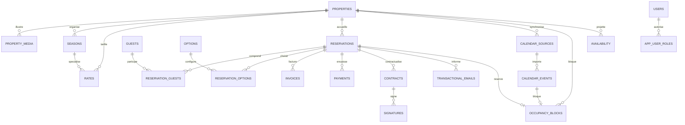

# Architecture Supabase Enterprise

Projet Supabase : `ydqtqfkzmovjdkmldhqr` — région `eu-west-1`.

## Principes

- PostgreSQL est la source durable des réservations, paiements, contrats et
  historiques.
- Les composants React n'accèdent jamais à Supabase. Ils passent par les routes
  serveur et les repositories de `platform/database`.
- Les prix sont calculés dans la couche métier. La base conserve les règles et
  fige le devis appliqué à chaque réservation dans `quote_snapshot`.
- `occupancy_blocks` est la source de vérité des indisponibilités. Une contrainte
  GiST et un verrou transactionnel par logement empêchent deux réservations
  directes concurrentes.
- Les URL iCal ne sont pas stockées en clair. `calendar_sources` conserve un nom
  de secret ou un contenu chiffré.
- Toutes les tables exposées ont RLS activé. Aucune politique anonyme ne donne
  accès aux données métier.

## Diagramme ERD

## Tables

| Domaine | Tables | Rôle |
| --- | --- | --- |
| Catalogue | `properties`, `property_media` | logements et médias ordonnés avec alt, crédits et licence |
| Tarification | `seasons`, `rates`, `promotions`, `options` | saisons, règles, frais, promotions et prestations |
| Voyageurs | `guests`, `consents` | données du voyageur et preuves de consentement |
| Réservation | `reservations`, `reservation_guests`, `reservation_options` | séjour et devis contractuel figé |
| Finance | `invoices`, `payments` | facturation, acompte, solde et remboursements |
| Contrats | `contracts`, `signatures` | versions HTML/PDF et signature externe |
| Communication | `transactional_emails` | état des messages sans stocker l'adresse en clair dans les journaux |
| Disponibilité | `calendar_sources`, `calendar_events`, `occupancy_blocks`, `availability`, `sync_runs` | imports et projection journalière |
| Administration | `users`, `app_user_roles`, `audit_logs` | admin, concierge, lecture seule et traçabilité |

## RLS

- `admin` : lecture générale et administration des données métier ;
- `concierge` : lecture générale, gestion des voyageurs, réservations et
  calendriers, sans modification des tarifs ni des rôles ;
- `read_only` : lecture opérationnelle uniquement ;
- voyageur authentifié : uniquement ses réservations, options, factures,
  paiements et contrats ;
- `anon` : aucun accès direct. La recherche publique passe par une API serveur
  validée et limitée.

La clé secrète Supabase n'est jamais préfixée `NEXT_PUBLIC_` et ne doit être
utilisée que dans les routes serveur.

## Fonctions et garanties

- `generate_reservation_number()` produit une séquence `BR-AAAA-000001` ;
- `is_property_available()` interroge les blocages ;
- `calculate_stay_price()` applique les tarifs journaliers prioritaires ;
- `create_direct_reservation()` crée voyageur, réservation, options et blocage
  dans une seule transaction idempotente ;
- `refresh_availability()` maintient la projection journalière ;
- `guard_occupancy_conflicts()` sérialise les écritures concurrentes par
  logement ;
- les triggers `audit_*` conservent les versions avant/après ;
- les triggers `notify_*` émettent uniquement un type d'entité et un identifiant,
  jamais de donnée personnelle.

## Storage

Buckets privés : `contracts`, `signed-contracts`, `photos`, `avatars`,
`documents`, `guestbook`, `invoices`.

Les téléchargements devront utiliser des URL signées à durée courte. Les
contrats signés et factures ne doivent jamais devenir publics.

## Migrations et retour arrière

- migration : `supabase/migrations/20260727170000_production_booking_foundation.sql`;
- catalogue et tarifs initiaux :
  `supabase/migrations/20260727171000_seed_current_catalog_and_rates.sql`;
- retour arrière manuel :
  `supabase/rollbacks/20260727170000_production_booking_foundation.down.sql`;
- retour arrière du catalogue :
  `supabase/rollbacks/20260727171000_seed_current_catalog_and_rates.down.sql`;
- tests SQL : `supabase/tests/production_booking_foundation.sql`.

Avant tout retour arrière : exporter la base, vérifier le projet cible et
arrêter les écritures. Le script de retour arrière est destructif par nature et
ne doit jamais être lancé automatiquement en production.

## Sauvegardes

Les migrations sont versionnées dans Git. Pour une exploitation payante :

1. utiliser au minimum Supabase Pro pour les sauvegardes quotidiennes ;
2. planifier un `supabase db dump` chiffré hors site ;
3. tester une restauration sur un projet distinct chaque trimestre ;
4. conserver les fichiers Storage dans une sauvegarde séparée ;
5. documenter RPO, RTO et responsables de restauration.
