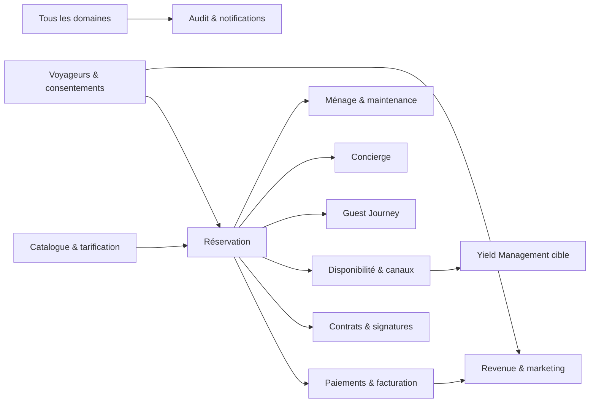

# Beaux Rivages — Modèle de données et persistance

Version : 1.0  
Auteur : Product Management & Data Architecture  
Statut : document de référence

## 1. Objet

Ce document définit le modèle de données de Beaux Rivages, les responsabilités de chaque agrégat et les règles de persistance applicables à Supabase/PostgreSQL, Storage, aux connecteurs externes et aux caches.

Il complète :

- la [Vision produit](PRODUCT_BOOK_01_VISION.md) ;
- la [Spécification UX](PRODUCT_BOOK_02_UX.md) ;
- les [Règles métier](PRODUCT_BOOK_03_BUSINESS_RULES.md).

Les migrations SQL versionnées restent la définition exécutable de la base. En cas d’écart, le présent document décrit l’intention cible et l’écart doit être arbitré, corrigé ou explicitement accepté.

## 2. Périmètre et statuts

Les éléments sont qualifiés ainsi :

- **DÉPLOYÉ** : présent dans les migrations versionnées ;
- **PARTIEL** : présent mais ne satisfait pas encore toutes les règles cibles ;
- **CIBLE** : modèle prévu, non garanti par le schéma actuel ;
- **À DÉCIDER** : choix produit, juridique ou d’exploitation requis.

Le modèle inventorié comprend actuellement **53 tables applicatives**.

## 3. Principes d’architecture

| Identifiant | Statut | Règle |
|---|---|---|
| DB-001 | DÉPLOYÉ | PostgreSQL est la source durable des réservations, paiements, contrats, disponibilités et historiques. |
| DB-002 | DÉPLOYÉ | Supabase fournit PostgreSQL, Auth, Row Level Security et Storage. |
| DB-003 | DÉPLOYÉ | Les composants React n’accèdent pas directement aux données métier privilégiées ; ils passent par les couches serveur et repositories. |
| DB-004 | DÉPLOYÉ | Les prix calculés sont figés dans un instantané de devis rattaché à la réservation. |
| DB-005 | CIBLE | Chaque donnée possède un système autoritatif, un propriétaire métier et une politique de conservation. |
| DB-006 | CIBLE | Les tables représentent des concepts métier, pas la forme temporaire d’un écran. |
| DB-007 | CIBLE | Les relations critiques utilisent des clés étrangères, contraintes, index et transactions. |
| DB-008 | CIBLE | JSONB est réservé aux instantanés, charges externes, métadonnées ou structures réellement variables. |
| DB-009 | CIBLE | Une règle métier structurante ne doit pas exister uniquement dans une propriété JSONB. |
| DB-010 | CIBLE | Les données dérivées sont identifiables et reconstructibles depuis leur source. |
| DB-011 | CIBLE | Toute écriture sensible est validée côté serveur et autorisée par RLS. |
| DB-012 | CIBLE | Aucun secret, numéro de carte ou code d’accès en clair n’est stocké dans une table publique ou un journal. |

## 4. Conventions de schéma

### 4.1 Nommage

- schéma applicatif principal : `public` ;
- tables et colonnes : `snake_case`, noms anglais ;
- tables au pluriel ;
- clés primaires : `id` ;
- clés étrangères : `<entity>_id` ;
- montants : suffixe `_cents`, entier, jamais `float` ;
- dates civiles : `date` ;
- instants : `timestamptz` ;
- plages de séjour : intervalle semi-ouvert `[arrival, departure)` ;
- codes ISO : `country_code` sur 2 caractères, `currency` sur 3 caractères ;
- identifiants externes : `provider` et `external_reference` ou nom équivalent ;
- booléens d’activation : `enabled` ou `active`, à harmoniser progressivement.

### 4.2 Colonnes communes cibles

Toute nouvelle entité métier mutable doit comporter :

| Colonne | Type cible | Rôle |
|---|---|---|
| `id` | `uuid` | identité interne non signifiante |
| `status` | enum ou texte contraint | cycle de vie explicite |
| `created_at` | `timestamptz` | date de création |
| `updated_at` | `timestamptz` | dernière modification |
| `created_by` | `uuid`, nullable système | acteur ou service créateur |
| `updated_by` | `uuid`, nullable système | dernier acteur ou service |

Exceptions admises :

- tables de liaison immuables ;
- journaux append-only ;
- projections reconstruisibles ;
- tables gérées par Supabase Auth ou Storage.

**Écart actuel :** plusieurs tables déployées ne possèdent pas encore `status`, `created_by`, `updated_by` ou même `updated_at`. Cet écart doit être résorbé par migrations progressives, sans réécriture destructive.

### 4.3 Valeurs contrôlées

- employer un enum PostgreSQL pour un cycle stable partagé ;
- employer `text` avec contrainte `check` pour un vocabulaire susceptible d’évoluer indépendamment ;
- ne jamais ajouter une valeur d’état sans mettre à jour les transitions, tests, types TypeScript et documentation ;
- les statuts archivés ne sont pas réutilisés pour une nouvelle signification.

## 5. Vue des domaines

## 6. Catalogue des tables déployées

### 6.1 Identité, accès et CRM

| Table | Source | Responsabilité | Persistance |
|---|---|---|---|
| `users` | Auth/Back Office | profil interne lié à `auth.users` | durable |
| `app_user_roles` | administration | rôles `admin`, `concierge`, `read_only` | durable |
| `guests` | réservation/CRM | identité et coordonnées du voyageur | durable, données personnelles |
| `consents` | formulaires/CRM | preuve versionnée d’un consentement ou retrait | append-oriented |
| `guest_access_secrets` | Guest Journey | secrets d’accès chiffrés ou protégés par réservation | temporaire/sensible |
| `loyalty_accounts` | Revenue Engine | niveau et métriques de fidélité | durable, recalculable en partie |

Relations principales :

- `users.id → auth.users.id` en un-à-un ;
- `app_user_roles.user_id → auth.users.id` ;
- `guests.user_id → auth.users.id`, facultatif et unique ;
- `consents.guest_id → guests.id` ;
- `loyalty_accounts.guest_id → guests.id`, un compte par voyageur.

Règles :

- l’e-mail de `guests` est normalisé en minuscules ;
- l’homonymie ne permet pas de fusion automatique ;
- la suppression d’un compte Auth ne doit pas effacer l’historique contractuel ;
- un consentement est un événement, jamais un simple booléen mutable ;
- les préférences CRM futures doivent être séparées des notes libres.

### 6.2 Maisons, médias et catalogue

| Table | Responsabilité | Relation structurante |
|---|---|---|
| `properties` | maison, localisation, capacité, fuseau, devise et statut | racine de nombreux agrégats |
| `property_media` | médias ordonnés, accessibilité, crédits et licence | plusieurs médias par maison |
| `options` | catalogue générique d’attentions | code fonctionnel unique |
| `property_options` | disponibilité et tarif d’une option par maison | liaison maison-option |
| `premium_experiences` | catalogue commercial Revenue Engine | expérience commercialisable |
| `concierge_categories` | catégories multilingues | parent des expériences Concierge |
| `concierge_experiences` | expériences multilingues, prix et confirmation | catégorie obligatoire |

Règles :

- `properties.slug` est stable, unique et compatible URL ;
- une maison retirée de la vente devient inactive ; elle n’est pas supprimée si un historique la référence ;
- un média possède exactement une origine : Storage ou URL externe ;
- les textes alternatifs, crédits et licences sont persistés avec les médias ;
- les codes catalogue sont uniques et ne doivent pas être recyclés ;
- les deux catalogues `options`/`premium_experiences`/`concierge_experiences` se recouvrent partiellement.

**Écart d’architecture CAT-01 :** trois représentations d’une expérience coexistent. La cible est un catalogue canonique `experiences`, complété par des traductions, tarifs, disponibilités par maison et règles opérationnelles. La convergence exige une migration de données et des adaptateurs temporaires.

### 6.3 Tarification

| Table | Responsabilité |
|---|---|
| `seasons` | périodes commerciales par maison |
| `rates` | tarifs journaliers, durées, ménage, taxe et caution |
| `promotions` | promotions du moteur de réservation |
| `revenue_promotions` | promotions enrichies du Revenue Engine |

Relations :

- une maison possède plusieurs saisons et tarifs ;
- un tarif peut référencer une saison ;
- une promotion peut cibler une maison ou rester globale.

Règles :

- toutes les valeurs financières utilisent les centimes ;
- `rates.priority` arbitre les règles concurrentes ;
- les plages de dates sont non vides ;
- les jours de semaine sont limités à `0..6` ;
- les devis acceptés ne sont pas recalculés lors d’un changement de tarif ;
- les codes promotionnels sont comparés sans sensibilité à la casse.

**Écart d’architecture PRI-01 :** `promotions` et `revenue_promotions` modélisent deux moteurs qui se chevauchent. Un contrat de lecture commun doit précéder toute fusion.

### 6.4 Réservations

| Table | Responsabilité |
|---|---|
| `reservations` | agrégat de séjour, canal, occupants et totaux figés |
| `reservation_guests` | participants et voyageur principal |
| `reservation_options` | lignes d’options figées au prix accepté |
| `reservation_notes` | notes internes rattachées au dossier |

Relations :

- `properties 1—N reservations` ;
- `reservations N—N guests` via `reservation_guests` ;
- une seule relation `reservation_guests.is_primary = true` par réservation ;
- `reservations 1—N reservation_options` ;
- `reservations 1—N reservation_notes`.

Invariants déployés :

- `departure > arrival` ;
- au moins un adulte ;
- nombres d’enfants, bébés et animaux positifs ou nuls ;
- `deposit_due_cents + balance_due_cents = total_cents` ;
- référence interne unique ;
- couple `(channel, external_reference)` unique lorsqu’il existe ;
- `idempotency_key` unique ;
- une option apparaît au plus une fois par réservation ;
- le prix de l’option est copié dans la ligne de réservation.

`quote_snapshot` conserve au minimum la version calculée des nuits, règles, frais, taxes, options, promotions et arrondis. Il s’agit d’une preuve de calcul, non du seul endroit où persister les totaux requêtables.

### 6.5 Facturation, paiements et cautions

| Table | Responsabilité |
|---|---|
| `invoices` | facture, facture d’acompte, solde ou avoir |
| `payments` | intention et résultat d’un mouvement financier |
| `payment_events` | événements fournisseurs reçus, idempotents et rejouables |
| `security_deposits` | autorisation, capture et libération de caution |

Relations :

- une réservation possède plusieurs factures et paiements ;
- un paiement peut être rattaché à une facture ;
- un événement fournisseur référence le traitement logique sans devenir la source du montant contractuel ;
- une caution référence une réservation.

Invariants :

- `payments.idempotency_key` est unique ;
- `(provider, provider_payment_id)` est unique lorsqu’il existe ;
- `amount_cents > 0` ;
- `0 ≤ refunded_cents ≤ amount_cents` ;
- `(provider, provider_session_id)` est unique pour les sessions configurées ;
- un événement fournisseur est réclamé atomiquement avant traitement ;
- les payloads fournisseurs sont privés et expurgés si nécessaire.

Règles cibles :

- les écritures comptables émises ne sont pas supprimées ;
- une correction financière produit un mouvement compensatoire ou un avoir ;
- aucune donnée de carte bancaire n’est persistée ;
- les factures publiées possèdent une numérotation légalement conforme et immuable ;
- la caution reste séparée du chiffre d’affaires.

### 6.6 Contrats et signatures

| Table | Responsabilité |
|---|---|
| `contracts` | versions du contrat et chemins HTML/PDF |
| `signatures` | demande et preuve de signature chez le fournisseur |

Invariants :

- numéro de contrat unique ;
- version strictement positive et unique par réservation ;
- hash de contenu pour vérifier la version signée ;
- identifiant de demande fournisseur unique lorsqu’il existe ;
- les documents signés ne sont jamais écrasés.

### 6.7 Disponibilité et calendriers

| Table | Responsabilité | Nature |
|---|---|---|
| `calendar_sources` | configuration iCal par maison et fournisseur | configuration |
| `calendar_events` | événements externes normalisés | miroir externe |
| `occupancy_blocks` | source de vérité des intervalles indisponibles | canonique |
| `availability` | projection quotidienne pour lecture rapide | reconstruisible |
| `sync_runs` | résultats d’import iCal | journal opérationnel |

Relations :

- une maison possède plusieurs sources ;
- une source contient plusieurs événements ;
- une réservation ou un événement peut produire un bloc d’occupation ;
- la projection journalière peut référencer réservation ou événement.

Invariants :

- les séjours utilisent `[arrival, departure)` : le jour de départ peut être un jour d’arrivée ;
- un bloc ne possède au plus qu’une origine détaillée parmi réservation et événement ;
- les réservations directes concurrentes sont protégées par verrou et contrainte GiST ;
- `(source_id, external_uid)` est unique ;
- `(property_id, day)` est unique dans la projection ;
- les URL iCal ne sont pas stockées en clair.

### 6.8 Channel Manager

| Table | Responsabilité |
|---|---|
| `channel_connections` | connexion logique Airbnb, Booking, Abritel ou future |
| `channel_listing_mappings` | correspondance annonce externe-maison |
| `channel_sync_jobs` | commande de synchronisation idempotente |
| `channel_conflicts` | conflit détecté et résolution |
| `channel_audit_logs` | journal spécialisé des échanges |

Règles :

- un mapping est unique pour une connexion et une maison ;
- un identifiant d’annonce externe ne doit pas pointer vers deux maisons actives ;
- un job conserve sens, état, tentative, curseur et erreurs ;
- un job rejoué conserve la même clé d’idempotence ;
- un conflit n’écrase jamais une réservation ;
- les payloads bruts nécessaires au diagnostic sont chiffrés, minimisés ou soumis à rétention.

### 6.9 Guest Journey

| Table | Responsabilité |
|---|---|
| `transactional_emails` | planification et résultat des messages |
| `guest_access_secrets` | informations d’accès protégées |

Invariants :

- un index d’idempotence empêche les envois transactionnels en double ;
- le destinataire peut être représenté par un hash dans les journaux ;
- les tentatives et dernières erreurs sont conservées ;
- les secrets sont servis uniquement à un voyageur vérifié ou à un rôle autorisé ;
- un secret possède une période de validité et une procédure de rotation.

### 6.10 Revenue et marketing

| Table | Responsabilité |
|---|---|
| `loyalty_accounts` | statut de fidélité et agrégats |
| `gift_cards` | valeur, solde, statut et échéance |
| `gift_card_uses` | mouvements d’utilisation |
| `revenue_promotions` | règles commerciales enrichies |
| `referrals` | relation parrain-filleul et récompenses |
| `premium_experiences` | catalogue d’upsell |
| `marketing_campaigns` | campagnes, audience et planification |
| `marketing_automations` | déclencheurs et scénarios |
| `review_requests` | demandes d’avis planifiées |

Règles :

- le solde d’une carte cadeau est égal à sa valeur initiale moins les mouvements validés ;
- les utilisations constituent un journal, pas un compteur modifié sans preuve ;
- les métriques de fidélité sont recalculables depuis les séjours éligibles ;
- une campagne conserve version de contenu, audience, consentement applicable et résultat ;
- le profilage marketing est séparé des besoins transactionnels.

### 6.11 Concierge

| Table | Responsabilité |
|---|---|
| `concierge_categories` | navigation et traductions |
| `concierge_experiences` | offre, inclusions, prix et validation |
| `concierge_orders` | panier/demande rattaché au séjour |
| `concierge_order_items` | lignes figées et état de réalisation |
| `concierge_special_requests` | occasions, allergies et demandes libres |
| `concierge_requests` | demandes opérationnelles du Back Office |

Règles :

- prix unitaire et quantité sont figés dans la ligne ;
- `total_cents` est généré par la base ;
- une commande appartient à une réservation ;
- une prestation soumise à confirmation reste en demande jusqu’à validation ;
- allergies et régimes sont des données à accès restreint ;
- `concierge_requests` et `concierge_special_requests` se chevauchent.

**Écart d’architecture CON-01 :** converger les demandes vers un agrégat unique, avec type, contenu structuré, sensibilité, workflow et assignation.

### 6.12 Back Office, ménage et maintenance

| Table | Responsabilité |
|---|---|
| `housekeeping_tasks` | préparation et checklist par séjour |
| `housekeeping_inspections` | contrôle qualité |
| `maintenance_incidents` | incident initial |
| `maintenance_interventions` | actions et coûts liés à l’incident |
| `inventory_items` | inventaire durable par pièce |
| `stock_items` | quantités et seuils de consommables |
| `operational_photos` | preuves privées |
| `operational_reports` | agrégats périodiques |
| `back_office_notifications` | alertes et lecture |
| `reservation_notes` | contexte interne du dossier |

Règles :

- les checklists conservent une révision pour la synchronisation hors ligne ;
- une mise à jour mobile utilise un verrou optimiste ;
- les photos appartiennent au bucket privé `operations` ;
- chaque photo opérationnelle référence sa maison et, si possible, son objet métier ;
- un incident peut avoir plusieurs interventions ;
- le stock ne devient jamais négatif sans événement d’ajustement autorisé ;
- les rapports sont dérivés et peuvent être régénérés.

### 6.13 Audit

| Table | Responsabilité |
|---|---|
| `audit_logs` | journal transverse avant/après |
| `channel_audit_logs` | événements techniques des canaux |
| `sync_runs` | exécutions de synchronisation calendrier |
| `payment_events` | événements de paiement entrants |

`audit_logs` conserve acteur, rôle, action, type et identifiant d’entité, identifiant de requête, hash d’IP, versions avant/après et métadonnées.

Le journal transverse est append-only. Il ne doit pas être modifiable par les rôles opérationnels.

## 7. Agrégats et frontières transactionnelles

### Agrégat Réservation

Racine : `reservations`.

Écritures atomiques attendues :

1. contrôle de disponibilité avec verrou par maison ;
2. création ou rapprochement prudent du voyageur ;
3. création de la réservation ;
4. ajout du voyageur principal et des lignes d’option ;
5. création du bloc d’occupation ;
6. inscription d’audit.

Les paiements, contrats et messages sont des agrégats distincts coordonnés par événements idempotents. Ils ne doivent pas allonger la transaction de réservation par des appels réseau.

### Agrégat Paiement

Racine : `payments`.

- création locale avant appel fournisseur ;
- corrélation par identifiant fournisseur ;
- traitement atomique des webhooks ;
- transition d’état monotone, sauf compensation explicite ;
- mise à jour de la réservation uniquement après événement fiable.

### Agrégat Commande Concierge

Racine : `concierge_orders`.

- lignes modifiables tant que la commande est au brouillon ;
- prix recalculé au serveur ;
- validation séparée des lignes soumises à disponibilité ;
- paiement référencé, jamais imbriqué dans la commande.

### Agrégat Incident

Racine : `maintenance_incidents`.

- interventions et photos rattachées ;
- fermeture de disponibilité coordonnée séparément ;
- clôture seulement après résolution et contrôle éventuel.

## 8. Écritures, transactions et concurrence

| Identifiant | Règle |
|---|---|
| PER-001 | Toute commande métier multi-table utilise une transaction PostgreSQL ou une fonction RPC transactionnelle. |
| PER-002 | Les appels réseau sont exécutés hors transaction ; leur résultat revient par événement idempotent. |
| PER-003 | Une création exposée aux réessais possède une clé d’idempotence avec contrainte unique. |
| PER-004 | Les mises à jour concurrentes opérationnelles utilisent une version ou un verrou optimiste. |
| PER-005 | La disponibilité utilise un verrou transactionnel par maison et une exclusion de chevauchement. |
| PER-006 | Un conflit d’unicité attendu est traduit en erreur métier, pas en erreur technique opaque. |
| PER-007 | Les traitements asynchrones réclament atomiquement leur travail avant exécution. |
| PER-008 | Une action partiellement réussie possède un mécanisme de reprise ou de compensation. |

## 9. Suppression et intégrité référentielle

### Politique

- `restrict` pour empêcher la suppression d’un parent contractuel ;
- `cascade` uniquement pour un enfant sans sens autonome ;
- `set null` pour conserver l’historique lorsque le parent peut disparaître ;
- archivage ou changement de statut plutôt que suppression des données métier ;
- suppression physique réservée aux brouillons sans dépendances, données temporaires expirées ou obligations RGPD validées.

Ne sont jamais supprimés silencieusement :

- réservation confirmée ;
- paiement ou remboursement ;
- facture ou avoir émis ;
- contrat signé ;
- consentement et retrait ;
- événement d’audit ;
- événement fournisseur déjà traité.

## 10. Row Level Security

Toutes les tables exposées doivent avoir RLS activée, même si l’API serveur constitue le chemin principal.

### Matrice cible

| Acteur | Lecture | Écriture |
|---|---|---|
| `anon` | catalogue explicitement public uniquement | aucune écriture métier directe |
| voyageur authentifié | ses réservations, documents, paiements, commandes et préférences | actions explicitement autorisées sur son dossier |
| `read_only` | données opérationnelles nécessaires | aucune |
| `concierge` | réservations, voyageurs et opérations nécessaires | gestion opérationnelle, sans rôles ni règles financières sensibles |
| `admin` | données métier générales | administration selon permissions |
| `service_role` | traitements serveur contrôlés | intégrations et automatisations |

Règles :

- une politique `select` ne vaut pas autorisation de mutation ;
- `using` et `with check` sont définis pour les mutations ;
- le voyageur est relié à ses données via `auth.uid()` et des relations contrôlées ;
- le catalogue public n’expose aucune note, stock interne ou donnée partenaire ;
- le `service_role` ne quitte jamais l’environnement serveur ;
- chaque migration ajoute les politiques et tests associés dans la même Pull Request.

**Écart actuel RLS-01 :** plusieurs modules récents accordent une gestion identique à `admin` et `concierge`. Une matrice de permissions par capacité devra remplacer progressivement cette granularité de rôle trop large.

## 11. Audit et traçabilité

Les opérations suivantes sont auditées :

- création, modification, annulation et changement de statut d’une réservation ;
- recalcul ou ajustement financier ;
- paiement, remboursement et caution ;
- contrat, signature, facture et avoir ;
- changement de tarif, promotion ou catalogue ;
- synchronisation, conflit et résolution ;
- accès ou rotation d’un secret ;
- intervention, preuve photo et clôture d’incident ;
- export, anonymisation ou suppression de données personnelles ;
- modification des rôles et permissions.

Un événement d’audit doit inclure :

- `occurred_at` ;
- acteur ou identité de service ;
- action ;
- entité et identifiant ;
- `request_id` ou `correlation_id` ;
- état avant/après minimisé ;
- origine et motif lorsque pertinent.

Les secrets, données bancaires et contenus sensibles ne sont jamais copiés dans l’audit.

## 12. Données externes et synchronisation

Chaque objet externe persiste :

- fournisseur ;
- identifiant externe stable ;
- horodatage fournisseur si disponible ;
- date de réception ;
- hash ou version ;
- état de traitement ;
- dernière erreur ;
- clé d’idempotence.

Règles :

- un webhook est enregistré avant traitement ;
- les événements peuvent arriver en retard ou dans le désordre ;
- le traitement vérifie la version ou l’état courant ;
- un payload brut n’est conservé que si nécessaire et selon une durée définie ;
- une synchronisation ne détruit jamais une donnée interne sans événement explicite ;
- les curseurs de pagination sont opaques ;
- les erreurs sont rejouables et observables.

## 13. Storage

Buckets privés déployés ou préparés :

- `contracts` ;
- `signed-contracts` ;
- `photos` ;
- `avatars` ;
- `documents` ;
- `guestbook` ;
- `invoices` ;
- `operations`.

Règles :

- accès par URL signée de courte durée ;
- chemin incluant l’entité propriétaire sans donnée personnelle lisible ;
- taille et MIME contrôlés ;
- nom original conservé uniquement en métadonnée si nécessaire ;
- contrôle antivirus prévu pour les documents entrants ;
- image opérationnelle limitée aux formats autorisés ;
- suppression du fichier coordonnée avec la référence en base ;
- les contrats signés, factures et preuves ne deviennent jamais publics ;
- sauvegarde de Storage distincte de la sauvegarde PostgreSQL.

## 14. Données personnelles et conservation

| Catégorie | Exemples | Politique cible |
|---|---|---|
| contractuelle | réservation, contrat, facture, paiement | durée légale/comptable validée |
| opérationnelle | messages, tâches, demandes | durée nécessaire au service puis purge |
| marketing | consentement, campagnes, fidélité | jusqu’au retrait ou à l’échéance définie |
| sensible | allergies, accès, preuves | accès minimal et rétention courte |
| technique | événements, erreurs, payloads | durée limitée selon diagnostic et sécurité |
| audit | actions critiques | durée définie, accès restreint |

Décisions requises :

1. durées exactes par catégorie ;
2. base légale ;
3. règles d’anonymisation ;
4. exceptions en cas de litige ;
5. responsables de traitement ;
6. procédure de réponse aux droits RGPD.

L’anonymisation doit préserver les agrégats financiers et opérationnels sans permettre de réidentifier le voyageur.

## 15. Indexation et performance

Index déployés prioritaires :

- réservations par maison/dates, statut/création et canal ;
- voyageurs par e-mail ;
- paiements et contrats par réservation ;
- tarifs par maison/activation/priorité ;
- événements calendaires par maison/dates ;
- blocages et saisons par index GiST de plage ;
- audit par entité et date ;
- tâches, incidents, alertes et synchronisations par statut/date ;
- commandes Concierge par réservation ;
- stocks par seuil d’alerte.

Règles :

- tout index répond à une requête observée ou une contrainte ;
- les index partiels sont privilégiés pour les files actives ;
- les nouvelles requêtes Back Office sont évaluées avec `EXPLAIN ANALYZE` sur un volume réaliste ;
- les recherches textuelles futures utilisent une stratégie dédiée, pas des `%LIKE%` généralisés ;
- les tableaux de bord lourds utilisent vues, agrégats ou projections rafraîchissables ;
- une projection contient une procédure de reconstruction.

## 16. Temps, fuseaux et devise

- les maisons portent leur fuseau, actuellement `Europe/Paris` ;
- arrivée et départ sont des dates civiles locales ;
- rendez-vous, envois et événements techniques sont des `timestamptz` ;
- aucune conversion ne suppose le fuseau du navigateur ;
- les montants conservent leur devise ;
- une réservation ne mélange pas plusieurs devises ;
- les taux de change futurs sont persistés avec source, date et taux appliqué ;
- les échéances légales ne sont pas recalculées à partir d’une simple durée lorsque la date contractuelle est connue.

## 17. Migrations

### Règles obligatoires

1. toute modification passe par une migration versionnée ;
2. aucune modification manuelle de production ;
3. nom : horodatage UTC et description stable ;
4. migration rejouable sur une base propre ;
5. contraintes et index ajoutés avec prudence sur les tables volumineuses ;
6. backfill explicite et vérifiable ;
7. code applicatif compatible pendant la transition ;
8. rollback ou plan de compensation documenté ;
9. tests SQL et applicatifs mis à jour ;
10. génération des types Supabase après changement ;
11. `DATABASE.md`, architecture, changelog et Product Book alignés.

### Déploiement évolutif

Pour une modification incompatible :

1. **expand** : ajouter colonnes/tables sans retirer l’ancien modèle ;
2. écrire dans les deux modèles si nécessaire ;
3. backfiller par lots ;
4. comparer les résultats ;
5. basculer les lectures ;
6. observer ;
7. **contract** : supprimer l’ancien modèle dans une migration ultérieure.

Un rollback destructif n’est jamais exécuté automatiquement en production.

## 18. Seeds et environnements

- les seeds de référence contiennent maisons, saisons, tarifs, options, catégories et checklists modèles ;
- les seeds sont déterministes et utilisent des clés fonctionnelles stables ;
- aucune donnée personnelle réelle dans les environnements de test ou preview ;
- les paiements de test sont clairement isolés ;
- les secrets et URLs privées ne figurent pas dans Git ;
- la production n’est jamais réinitialisée à partir d’un seed ;
- les environnements possèdent des projets ou schémas distincts.

## 19. Sauvegarde et continuité

Politique minimale cible :

- sauvegarde PostgreSQL quotidienne ;
- Point-in-Time Recovery selon le plan Supabase retenu ;
- export chiffré hors site ;
- sauvegarde Storage indépendante ;
- test de restauration trimestriel sur un environnement isolé ;
- RPO et RTO documentés ;
- responsables et procédure d’incident identifiés ;
- contrôle d’intégrité après restauration ;
- conservation des migrations correspondant au snapshot restauré.

Les sauvegardes ne remplacent ni l’audit, ni l’idempotence, ni un plan de compensation.

## 20. Observabilité et qualité

Mesures minimales :

- durée et échec des requêtes critiques ;
- connexions et saturation ;
- taille et croissance des tables/index ;
- verrous et contentions ;
- synchronisations en échec ;
- événements de paiement non traités ;
- files de messages en retard ;
- conflits de disponibilité ;
- taux d’erreur RLS/autorisation ;
- âge de la dernière sauvegarde testée.

Les alertes ne contiennent pas de données personnelles ou de secrets.

## 21. Tests de persistance

Chaque évolution couvre selon son risque :

- migration depuis l’état précédent ;
- création sur base vide ;
- contraintes de domaine ;
- clés étrangères et comportements de suppression ;
- unicité et idempotence ;
- concurrence de réservation ;
- calcul et cohérence financière ;
- transitions d’état ;
- RLS par rôle et par propriétaire ;
- webhook dupliqué ou désordonné ;
- reconstruction des projections ;
- rollback ou compensation ;
- performance des requêtes principales.

Le socle dispose déjà de tests SQL pour les réservations, conflits d’occupation et RLS. La cible est une suite automatisée couvrant chaque migration métier.

## 22. Écarts et décisions d’architecture

| Référence | Priorité | Écart | Décision cible |
|---|---|---|---|
| GAP-001 | haute | champs communs incomplets sur plusieurs tables | ajouter progressivement `status`, auteurs et horodatages selon pertinence |
| GAP-002 | haute | permissions `concierge` parfois trop larges | passer à des capacités plus fines |
| GAP-003 | haute | trois catalogues d’expériences | définir un catalogue canonique et migrer |
| GAP-004 | haute | deux modèles de promotions | créer un contrat commun puis converger |
| GAP-005 | moyenne | deux modèles de demandes Concierge | unifier le workflow |
| GAP-006 | haute | rétention RGPD non chiffrée | valider et automatiser les politiques |
| GAP-007 | haute | types générés Supabase non identifiés comme artefact contrôlé | générer et vérifier en CI |
| GAP-008 | moyenne | audit non généralisé à tous les modules récents | étendre les triggers/événements |
| GAP-009 | moyenne | plusieurs statuts en `text` dupliqués | établir un registre des transitions |
| GAP-010 | haute | Yield Management non présent dans le schéma de cette branche | intégrer sa migration après validation de la PR dédiée |
| GAP-011 | moyenne | projections et rapports sans contrat de reconstruction commun | standardiser jobs, version et fraîcheur |
| GAP-012 | haute | stratégie de sauvegarde à confirmer au niveau du plan Supabase | fixer RPO, RTO et test de restauration |

## 23. Modèle cible à ajouter

Les besoins suivants ne doivent être créés qu’après validation de leur agrégat :

| Domaine | Entités cibles possibles | Finalité |
|---|---|---|
| catalogue unifié | `experiences`, `experience_translations`, `property_experiences`, `experience_prices` | remplacer les catalogues redondants |
| CRM | `guest_preferences`, `guest_tags`, `guest_merge_candidates` | préférences structurées et dédoublonnage contrôlé |
| droits | `permissions`, `role_permissions` | autorisations fines |
| documents | `document_versions` | versionnement transversal et rétention |
| événements | `outbox_events`, `job_attempts` | intégrations fiables et reprise |
| données personnelles | `data_subject_requests`, `retention_runs` | obligations RGPD |
| BI | `metric_snapshots`, vues matérialisées | cockpit décisionnel |
| IA | `ai_recommendations`, `ai_decisions`, `ai_feedback` | propositions traçables, sans action autonome implicite |

Les noms restent indicatifs jusqu’à la conception DDD détaillée. Aucun ajout ne doit dupliquer une responsabilité déjà couverte.

## 24. Définition de terminé

Une évolution de données est terminée lorsque :

- l’agrégat et son propriétaire sont définis ;
- la migration et son plan de compensation sont relus ;
- contraintes, index, triggers et RLS sont présents ;
- les données existantes sont backfillées et vérifiées ;
- les types TypeScript sont régénérés ;
- repositories et actions serveur sont alignés ;
- les tests de migration, sécurité et intégration passent ;
- l’audit et l’observabilité sont actifs ;
- la documentation est mise à jour ;
- la restauration ou reconstruction est démontrée lorsque pertinente ;
- aucune donnée réelle n’a été copiée vers un environnement non autorisé.

## 25. Références exécutables

Le schéma actuel est construit par les migrations présentes dans `supabase/migrations/`, notamment :

- fondation réservation et Supabase ;
- catalogue et tarifs initiaux ;
- paiements Stripe et reprise d’événements ;
- Guest Journey ;
- Revenue & Marketing Engine ;
- Back Office Premium ;
- Channel Manager Premium ;
- Concierge Premium ;
- Housekeeping & Maintenance.

Les scripts `supabase/rollbacks/` constituent des aides opératoires, pas une autorisation de retour arrière automatique. Les tests de fondation résident dans `supabase/tests/`.
